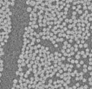
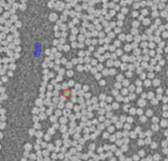
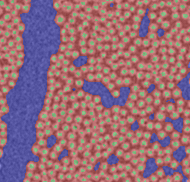
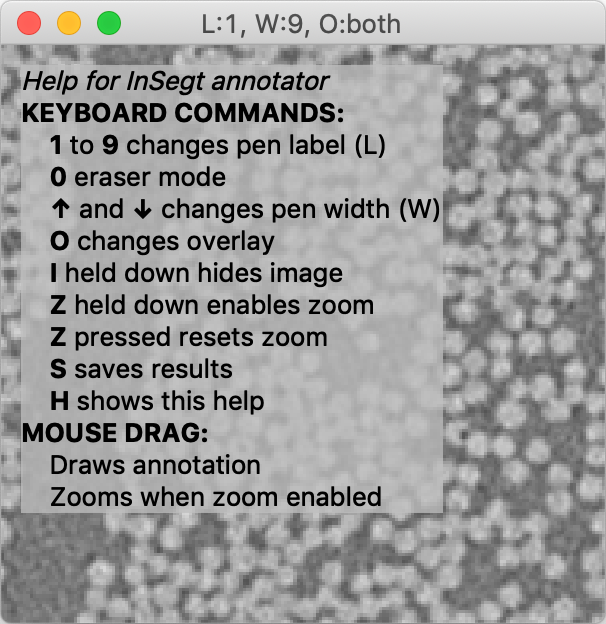
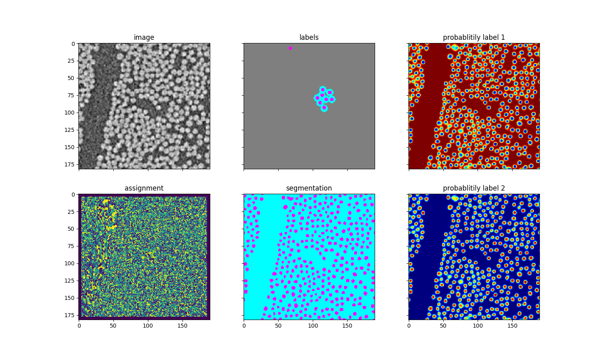

## InSegtPy

*A py version of [InSegt](https://github.com/vedranaa/InSegt)*

Contains:

* `demo_insegt.py`, a demo script showing how `insegtannotator` together with `insegtbasic` may be used for interactive segmentation.

Input image | User labelings | Segmentation result | Screenshot
:---:|:---:|:---:|:---:
  |   |  | 

* `insegtbasic.py`, a module providing basic InSegt image processing functionality. Features (and differences compared to matlab version):
   - Purely python. (In matlab, we use mex files written in C++.)
   - It uses intensities from image patches as features for clustering. (In matlab, we have: patch-based, normalized patches, SIFT features, PCA features, Gaussian-derivative features.)
   - Uses minibatch k-means from sklearn for clustering. (In matlab, we use k-means tree.)
   - Unlabeled pixels have zeros in label images. (In matlab, we distribute the probabilities to all classes if a pixel is unlabeled. We need to figure out what's best, and whether it matters.)

* `demo_insegtbasic.py`, a demo script that processes an image using functionality from `insegtbasic.py`.
   - In particular, it uses `insegtbasic.patch_clustering` function for building the dictionary and `insegtbasic.two_binarized` function for processing the label image into a segmentation image.
   - No interaction! Instead, you load an image to be segmented, and an image of the same size containing the user labeling.

* `demo_insegtbasic_processing_explained.py`, similar to  the demo above, but the processing implemented in `insegtbasic.two_binarized` is divided into steps and visualized in more detail.
  - In particular, here you have access to assignment image and the probability images for different labels.

* `annotator.py`, a module containing the `Annotator` class. `Annotator`, is a widget for drawing on an image. It is based on [qt for python](https://doc.qt.io/qtforpython/). All interaction is using mouse
clicks, draws, and keyboard input. Help is accessed by pressing **H**. Built-in example uses an image from `skimage.data`.

* `insegtannotator.py`, a module containing `InSegtAnnotator` class, which is a subclass of `Annotator` extended with the functionality for interactive segmentation. To use `InsegtAnnotator` you need a processing function that given labels (annotations) returns a  segmentation.  Built-in example uses an image from `skimage.data` and a processing function based on a mean color for every label, and a pixel-to-color distance.

* `demo_km.py`, a demo showing the use of k-means clustering. Uses the module `km_dict.py`, which relies on `km_dict.cpp` compiled into `km_dict_lib.so`.

* `demo_feat.py`, a demo showing feature-based segmentation. Uses the module `feat_seg.py` which relies on `image_feat.cpp` compiled into `image_feat_lib.so`.
