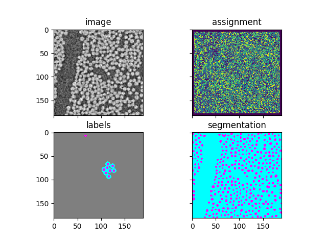

## InSegtPy

*A simplistic py version of InSegt*.

Contains:

* `insegtbasic.py`, a module providing basic InSegt functionality. Features (and differences compared to matlab version):
   - Purely python.
   - Uses only patch-based features for clustering. (In matlab we have: patch based, normalized patches, SIFT features, PCA features, Gaussian-derivative features.)
   - Uses minibatch k-means from sklearn for clustering. (In matlab we use k-means tree implemented in C++ and compiled as mex file.)
   - Unlabeled pixels have zeros in label images. (In matlab we distribute the probabilities to all classes if a pixel is unlabeled, need to figure out what's best, and whether it matters.)

* `insegt_without_interaction.py`, a script for processing an image using methods from `insegtbasic.py`. 
   - No interaction! Instead, you load an image and a corresponding image containing the user labeling. See below the segmentation computed by inSegt_script.py, given an image and labels. 

